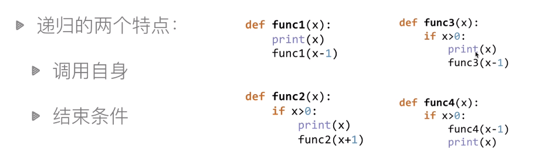
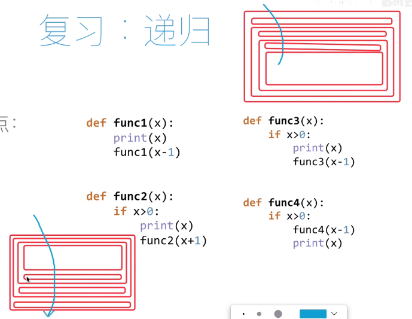
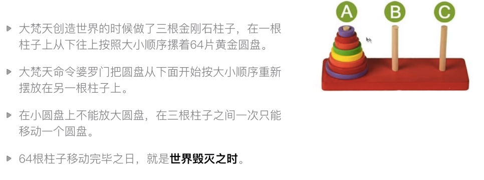
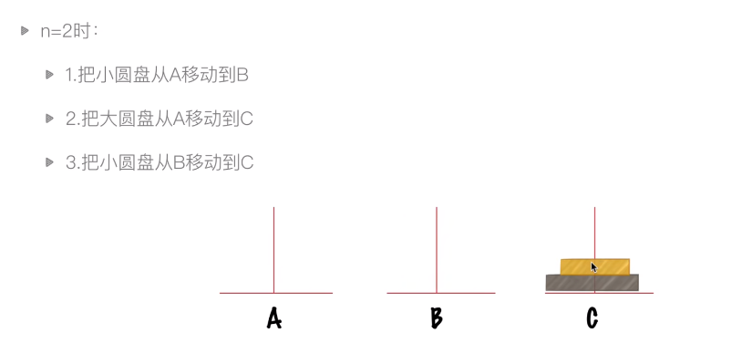
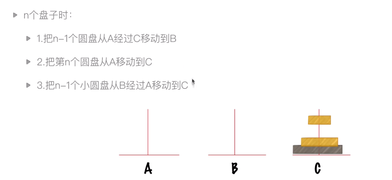
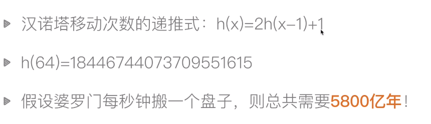
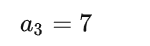
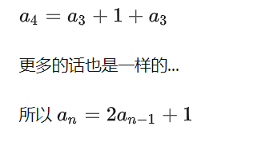

## 递归

https://www.bilibili.com/video/BV1uA411N7c5?p=5&vd_source=e1de9f6d02128b9c85f5fdd03c7e72fc





### 递归实例:汉诺塔问题









时间复杂度 O（n^2）

帮助理解：

https://www.zhihu.com/question/24385418

### 如何理解汉诺塔的递归

 

三个盘子的[汉诺塔 




然后你移完发现左边柱子下面又蹦出来一个盘子


 把中间的柱子看成[目标柱](https://www.zhihu.com/search?q=%E7%9B%AE%E6%A0%87%E6%9F%B1&search_source=Entity&hybrid_search_source=Entity&hybrid_search_extra=%7B%22sourceType%22%3A%22answer%22%2C%22sourceId%22%3A282940567%7D)


然后把最大的移到右边, 然后就和搬三个一模一样了




---

所以说一共就三步

1. 把 n-1 号盘子移动到缓冲区
2. 把1号从起点移到终点
3. 然后把缓冲区的n-1号盘子也移到终点

所以写成py代码就是

```python3
def move(n,from,buffer,to):
    if n==1:
        print('Move',n,'from',from,'to',to)
    else:
        move(n-1,from,to,buffer)
        move(1,from,buffer,to)
        move(n-1,buffer,from,to)
```

1. 要从a到b 那c就是缓冲 move(n-1,from,to,buffer)
2. 要从a到c 那b就是缓冲 move(1,from,buffer,to)
3. 要从b到c 那a就是缓冲 move(n-1,buffer,from,to)